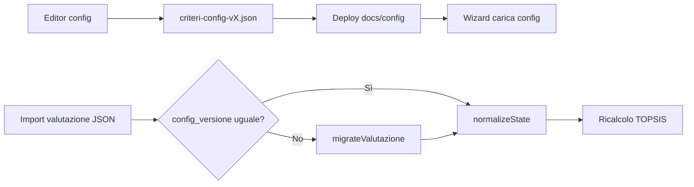

# Piano di migrazione — configurazione criteri e valutazioni salvate

Questo documento descrive come gestire i file JSON di **valutazione** (`valutazione-comparativa-software`) quando cambia la **configurazione criteri** (`criteri-config-valcomp`).

## Due tipi di JSON distinti

| Tipo | File | Contenuto |
|------|------|-----------|
| **Config criteri** | `docs/config/criteri-config-v1.0.json` | Definizione criteri, pesi TOPSIS, voci TCO, suggerimenti, formule di scoring |
| **Valutazione** | export dal wizard | Dati compilati da una PA: prodotti, risposte ai criteri, TCO, pesi usati, ranking |

La config è **condivisa** da tutte le valutazioni. Ogni valutazione esportata include:

```json
{
  "config_id": "criteri-config-v1.0",
  "config_versione": "1.0",
  "config_criteri": { "... snapshot completo config al momento dell'export ..." },
  "valutazione": { ... }
}
```

### Snapshot `config_criteri`

`config_id` / `config_versione` identificano la config, ma non catturano modifiche «silenziose» (stessa versione, testi o formule cambiati). Lo snapshot è una copia integrale di `criteri-config-*.json` al momento dell'export.

**All'import** il wizard confronta `config_criteri` con la config attualmente caricata e segnala:

- criteri / voci TCO aggiunti o rimossi;
- formule di scoring modificate;
- differenze id/versione.

Export legacy **senza** `config_criteri`: confronto limitato; compare un avviso all'utente.

## Principi

1. **Versionamento esplicito** — ogni config ha `versione` e `id`; ogni valutazione registra quale config ha usato.
2. **Non perdere dati** — campi obsoleti vanno in `_legacy`, non eliminati silenziosamente.
3. **Migrazione all'import** — al caricamento di una valutazione con config diversa, `ValcompConfig.migrateValutazione()` normalizza lo stato.
4. **Ricalcolo TOPSIS** — dopo migrazione i punteggi vanno ricalcolati; la classifica può cambiare se cambiano formule o pesi default.

## Tipologie di modifica alla config

### 1. Modifica descrittiva (sicura)

- Testi criteri, suggerimenti (`field_help`), link `ref_links`, etichette TCO.
- **Impatto valutazioni:** nessuno sui dati; solo UI e report.

### 2. Aggiunta (compatibile)

- Nuovo criterio TOPSIS + voce in `pesi_def`.
- Nuova voce si/no in un gruppo esistente.
- Nuova voce TCO.

**Comportamento:**

- Valutazioni vecchie: `normalizeState()` crea valori default (vuoti / zero).
- Export: dopo salvataggio avranno i nuovi campi.
- `_legacy`: non toccato.

### 3. Rinomina (richiede migration rule)

Aggiungere in `config.migrations`:

```json
{
  "from_version": "1.0",
  "to_version": "1.1",
  "rename_criteri": [{ "from": "sicurezza", "to": "sicurezza_informatica" }],
  "rename_pesi": [{ "from": "sicurezza", "to": "sicurezza_informatica" }]
}
```

### 4. Rimozione (archivio)

- Criterio, voce si/no o voce TCO rimossi dalla config.

**Comportamento automatico (`migrateValutazione`):**

- Dati spostati in `valutazione._legacy.criteri`, `_legacy.tco_voci`, `_legacy.pesi`.
- Avviso all'utente in import.
- I dati restano nel JSON per audit e ripristino manuale.

### 5. Modifica formula scoring (breaking)

Esempi: peso vitalità, soglia giorni, fattore dipendenze proprietarie.

**Comportamento:**

- Dati grezzi invariati; **classifica TOPSIS cambia** al prossimo calcolo.
- Incrementare `versione` config (es. `1.0` → `1.1`).
- Documentare in CHANGELOG cosa è cambiato nel ranking.

### 6. Modifica struttura TOPSIS (breaking forte)

Esempio: rimuovere un criterio da `pesi_def` usato con peso > 0.

**Comportamento:**

- Peso archiviato in `_legacy.pesi`.
- Validazione pre-calcolo può segnalare pesi mancanti.
- Valutazioni andrebbero riviste manualmente.

## Flusso operativo consigliato



### Passi per pubblicare una nuova config

1. Modificare con `docs/config-editor.html` o edit diretto del JSON.
2. Incrementare `versione` e aggiornare `id` (es. `criteri-config-v1.1.json`).
3. Aggiungere regole in `migrations` se ci sono rename.
4. Testare import di almeno una valutazione v1.0 di esempio.
5. Aggiornare riferimento in `ValcompConfig.DEFAULT_URL` o mantenere un solo file attivo.
6. Documentare in commit/CHANGELOG.

### Passi per l'utente PA con valutazioni esistenti

1. Esportare JSON **prima** dell'aggiornamento dello strumento.
2. Dopo aggiornamento: importare il JSON.
3. Leggere eventuali avvisi di migrazione.
4. Verificare tab Criteri / TCO per campi nuovi o vuoti.
5. Ricalcolare TOPSIS e riesportare.

## Campo `_legacy` nello schema valutazione

```json
"_legacy": {
  "criteri": { "vecchio_gruppo": { ... } },
  "tco_voci": { "vecchia_voce": [1000, 2000] },
  "pesi": { "criterio_rimosso": 0.5 }
},
"_migrated_from": {
  "id": "criteri-config-v1.0",
  "versione": "1.0",
  "il": "2026-06-17T10:00:00.000Z"
}
```

- `_legacy` **non** entra nel calcolo TOPSIS.
- Può essere incluso nell'export per tracciabilità normativa.
- Opzionale: sezione «Dati archiviati» nel PDF di stampa.

## Compatibilità valutazioni senza `config_versione`

Valutazioni esportate prima di questa funzionalità:

- Assunte come `config_versione: "1.0"`, `config_id: "criteri-config-v1.0"`.
- Sottoposte a `migrateValutazione` + `normalizeState` come le altre.

## Editor configurazione

- **Online (GitHub Pages):** https://teamdigitale.github.io/devita-ccros-valcomp-software-pa/config-editor.html
- **Sorgente:** `docs/config-editor.html`
- Tab **Criteri:** crea/modifica/elimina gruppi e voci, cambia tipo (sinon, radio, …); sincronizza automaticamente `pesi_def` e `scoring.count_si_groups` / `radio_groups`
- Scarica JSON da sostituire in `docs/config/criteri-config-v1.0.json`
- Validazione: `tipo`, `versione`, `criteri`, `pesi_def`, `tco_voci`

## Evoluzione futura (v2)

- Schema JSON Schema dedicato: `docs/schema/criteri-config-v1.0.json`
- Test automatici: fixture valutazione + assert migrazione
- Più file config per profili (es. «solo CAD minimo» vs «completo CCROS»)
- Selector config in wizard per PA che usano profili custom
