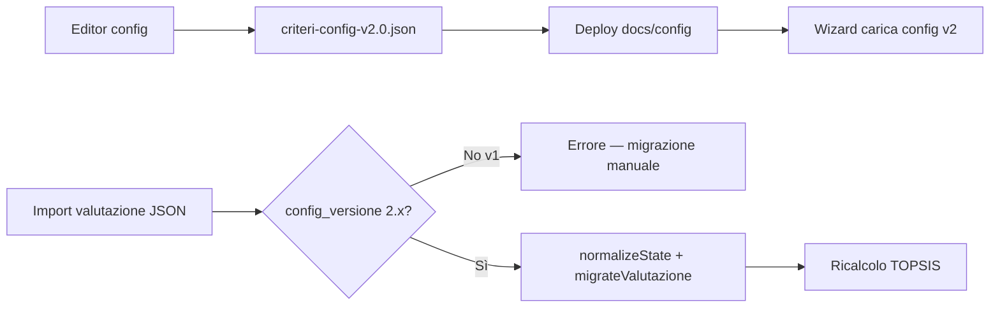

# Piano di migrazione — configurazione criteri e valutazioni salvate

## Breaking change: config v2.0

A partire dalla **config v2.0** il wizard carica solo `criteri-config-v2.0.json`. Non esiste migrazione automatica da export con `config_versione: "1.0"`.

### Cosa cambia in v2

| v1 | v2 |
|----|-----|
| `criteri` oggetto + `pesi_def` | `criteri[]` array ordinato con `peso_default` per voce |
| `tipo: sinon` / `sinon_nonec` | `input.type: si_no` / `si_no_na` |
| `tipo: radio` | `input.type: scelta_unica` |
| Valore `nonec` | Valore `na` (etichetta UI «N/A») |
| `scoring.*` globale | `score.method` per ogni criterio |
| `cost_criteria` | `direction: benefit \| cost` su ogni criterio |
| `pesi_preset` array posizionale | `pesi_preset` oggetto `{ criterioId: peso }` |

### Valutazioni esportate con config v1

1. **Import v1 → rifiutato** con messaggio esplicito e riferimento a questo documento.
2. Per recuperare una valutazione v1: aprire il JSON, ricompilare manualmente i criteri nel wizard v2 (o script one-shot), riesportare con `config_versione: "2.0"`.
3. Non sono supportati alias runtime (`sinon`, `nonec`) nel codice v2.

### File attivi

| Tipo | File |
|------|------|
| Config criteri | `docs/config/criteri-config-v2.0.json` |
| Schema config | `docs/schema/criteri-config-v2.0.json` |
| Motore scoring | `docs/js/valcomp-scoring.js` |
| Rendering form | `docs/js/valcomp-render.js` |

---

## Due tipi di JSON distinti

| Tipo | File | Contenuto |
|------|------|-----------|
| **Config criteri** | `docs/config/criteri-config-v2.0.json` | Array `criteri[]` con `input` + `score`, voci TCO, preset pesi, suggerimenti |
| **Valutazione** | export dal wizard | Dati compilati da una PA: prodotti, risposte ai criteri, TCO, pesi usati, ranking |

La config è **condivisa** da tutte le valutazioni. Ogni valutazione esportata include:

```json
{
  "config_id": "criteri-config-v2.0",
  "config_versione": "2.0",
  "config_criteri": { "... snapshot completo config al momento dell'export ..." },
  "valutazione": { ... }
}
```

### Snapshot `config_criteri`

`config_id` / `config_versione` identificano la config, ma non catturano modifiche «silenziose» (stessa versione, testi o formule cambiati). Lo snapshot è una copia integrale di `criteri-config-*.json` al momento dell'export.

**All'import** il wizard confronta `config_criteri` con la config attualmente caricata e segnala:

- criteri / voci TCO aggiunti o rimossi;
- formule `score` modificate;
- differenze id/versione.

Export legacy **senza** `config_criteri`: confronto limitato; compare un avviso all'utente.

## Principi (v2)

1. **Versionamento esplicito** — config `versione` 2.x; valutazioni con `config_versione: "2.0"`.
2. **Modello dichiarativo** — ogni criterio definisce `input.type` (form) e `score.method` (calcolo).
3. **Migrazione all'import** — solo tra versioni v2 compatibili via `ValcompConfig.migrateValutazione()`; v1 non importabile.
4. **Ricalcolo TOPSIS** — dopo migrazione i punteggi vanno ricalcolati; la classifica può cambiare se cambiano formule o pesi default.

## Tipologie di modifica alla config v2

### 1. Modifica descrittiva (sicura)

- Testi criteri, `field_help`, `ref_links`, etichette TCO.
- **Impatto valutazioni:** nessuno sui dati; solo UI e report.

### 2. Aggiunta (compatibile)

- Nuovo elemento in `criteri[]` con `peso_default`.
- Nuova voce in `input.items` o `input.fields`.
- Nuova voce TCO.

**Comportamento:** `normalizeState()` crea valori default; export successivi includono i nuovi campi.

### 3. Rinomina (richiede migration rule)

Regole in `migrations` nel JSON config (stesso meccanismo v1, adattato agli id in `criteri[]`).

### 4. Rimozione (archivio)

Dati spostati in `valutazione._legacy` con avviso all'import.

### 5. Modifica `score` (breaking)

Incrementare `versione` config e documentare in CHANGELOG. I dati grezzi restano; la classifica TOPSIS cambia al ricalcolo.

## Flusso operativo



### Pubblicare una nuova config v2

1. Modificare con `docs/config-editor.html` o edit diretto.
2. Incrementare `versione` / `id` se breaking (es. `criteri-config-v2.1.json`).
3. Aggiornare `DEFAULT_URL` in `docs/js/valcomp-config.js` se si cambia file attivo.
4. Validare con il pulsante **Valida** nell'editor.
5. Testare wizard e import di una valutazione v2 di esempio.

### Editor configurazione

- **Online (GitHub Pages):** https://teamdigitale.github.io/devita-ccros-valcomp-software-pa/config-editor.html
- **Sorgente:** `docs/config-editor.html` + `docs/js/config-editor-app.js`
- Tab **Criteri:** `input.type`, voci, editor **Score** (`method` + parametri)
- Tab **Pesi:** `peso_default`, `direction`, preset macro-categoria per id
- Validazione: `ValcompConfig.validate()` (v2 only)

## Campo `_legacy` nello schema valutazione

```json
"_legacy": {
  "criteri": { "vecchio_gruppo": { ... } },
  "tco_voci": { "vecchia_voce": [1000, 2000] },
  "pesi": { "criterio_rimosso": 0.5 }
}
```

- `_legacy` **non** entra nel calcolo TOPSIS.
- Valori checklist supporto: `si`, `no`, `na` (non più `nonec`).

## Config v1 (deprecata)

`docs/config/criteri-config-v1.0.json` resta nel repository come riferimento storico. Il wizard **non** la carica più. Per confronto v1→v2 vedere la tabella in cima a questo documento.
